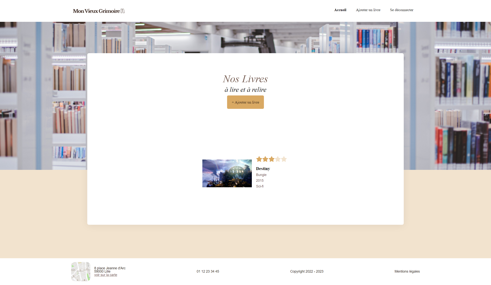

# Mon vieux grimoire / Node - React

## What this project is for?
School project 6 for my training as full-stack web developper with OpenClassrooms.

## Description
On this project, React front end was already given and goal is to link it to Node backend starting from scratch. This website is made list books, adding new one, delete or updating them but also rating them. For this used Node with controllers, models, middlewares and routes.

## Technologies
- Node
- Express
- Mongoose

## Hosted result of project

This project can only be seen using Frontend and backend yourself:

**Frontend**
- Get front end here : https://github.com/OpenClassrooms-Student-Center/P7-Dev-Web-livres
- cd frontend
- npm install
- npm run start

**Backend**
- Clone this repository 
- cd backend
- npm install
- nodemon server.js

## How to Contribute
Contact me on my portfolio : https://www.dosylia.com/
